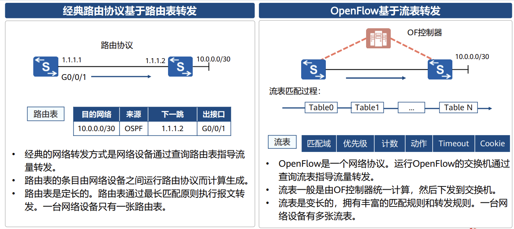

# SDN与NFV概述

## SDN概述

### 传统网络的缺点

提出了分层的思想

### 经典网络的现状：经典IP网络-分布式网络

经典IP网络是一个分布式的、对等控制的网络。每台设备存在独立的数据平面，控制平面和管理平面

每个路由器都是这样，优点在于有很强的解耦性，厂家之间的兼容性较好

### 经典网络面临问题

#### 网络易拥塞

主要问题在于没有一个全局观，只会根据最优进行选择，当链路拥塞的时候，不会去选择其他位置的路由或者路径进行使用

#### 网络技术太复杂

协议多、配置难

协议多、配置量增加

#### 网络故障定位、诊断困难

#### 业务部署速度太慢

物理网络的调整会变成网络策略，配置方面的调整

### SDN定义

#### SDN起源

SoftWare Defined Networking 软件定义网络 斯坦福大学提出的新型网络创新架构 核心理念通过网络设备控制平面与数据平面分离，实现网络控制平面的集中控制，为网络应用的创新提供了良好支持

提出了三个概念 “转控分离 、 集中控制 、 开放可编程接口”

#### OpenFlow基本概念

是控制器和交换机之间的一种南向接口协议。定义了三种类型消息，Controller to Switch、Asynchronous和Symmetric。每种消息包含了更多的子类型。

**记忆消息类型**

#### FlowTable简介

#### 转发方式对比

#### SDN本质诉求

#### SDN网络架构

####  华为SDN网络架构

### iMaster NCE解决方案

## NFV概述

### NFV背景

### NFV起源

### NFV价值

运营商硬件繁多 部署复杂 减轻设备跑多个虚拟机完成工作

### NFV关键技术：虚拟化

特殊的云计算 虚拟机上安装了一些专门为网络功能设计的一些软件

NFV关键特性：云化

按需自助：自行购买参数配置的内容

资源池：所有资源就是知道在用，但是不知道从哪里来的。

快速弹性伸缩：可以自行修改配置

可计量：根据不同配置设定不同的价格

### NFV架构简介

NFVI 云化资源池 基础设施层

NFV VNF 虚拟机 软件层面实现的功能

OSS/BSS 

MANO：二三层的管理机构

### NFV的标准架构

NFVI下层的硬件资源通过VI-Ha接口实现虚拟化，再通过Vn-Nf接口来被VNF所使用自动调用 针对不同的层有不同的管理接口

### NFV架构功能模块

### NFV架构接口

### 华为NFV解决方案

## 本章小结

