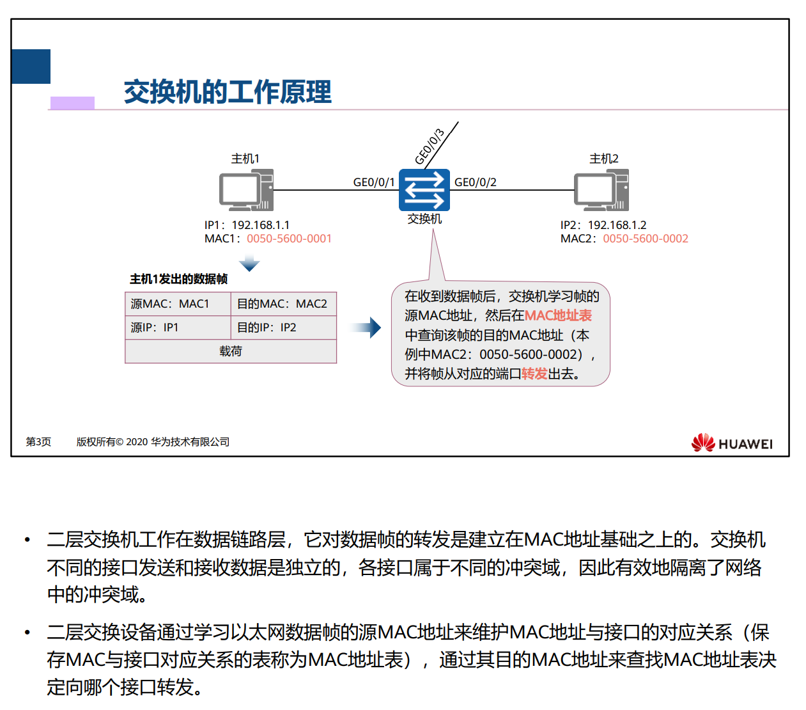

# 以太网交换基础

## 以太网协议介绍

是当今现有局域网采用的最通用的通信协议标准 定义了局域网汇总采用的电缆类型和信号处理方法。

早期的以太网是建立在CSMA/CD的机制上的广播形网络。就是当我要向链路当中发送信息的时候，先侦听一下网络当中有没有人在进行发送消息，如果有的话，那么就过段时间再侦听，没有的话进行发送，当产生冲突的时候，停止发送并等待一个随机的时间再进行发送 当然，这个是建立在总线型的网络拓扑上的。

### 冲突域

交换机每个端口是一个独立的冲突域，和其他端口独立，自己有一定的带宽，且固定

### 广播域

广播报文所能达到的整个访问范围称为二层广播域，简称广播域

交换机并不能隔离广播域，只能隔离冲突域

### 以太网卡

## 以太网帧介绍

### 以太网帧格式

 

单播一对一，组播多对一

单播，组播，广播分别对应

## 以太网交换机介绍

### 二层交换机

工作在数据链路层 对数据包的转发建立在MAC上

三层交换机的建立是在数据通信网络范围的不断扩大上的。网络间互访的需求越来越大。

### 交换机工作原理

### MAC地址表

MAC表中有的话，直接进行转发，没有的话进行泛洪。

### 交换机的MAC地址学习

初始情况下，MAC地址表为空，

当交换机接入之后，如果1要向2发送消息的话，那么会将数据包丢给交换机，数据包中包含了1的原MAC地址以及目的MAC地址，当然这个目的MAC地址并不在MAC表当中，于是交换机对这个MAC地址进行泛洪，给所有的端口全部发送一份，当然只有主机2能够收到对应的包。其他主机默认不接受非本MAC地址的包，接下来，主机2给主机1发送报文的时候，交换机可以直接根据从1向2发送时候产生的MAC地址表来给1发送，此时记录下2的MAC地址。完成学习

MAC地址的存在是有时效性的，到达生存周期之后仍得不到更新的表项将被删除

### 交换机转发过程

交换机的三种数据帧处理行为 分别是 转发 泛洪 丢弃

泛洪只有两种 要么是广播 要么是单播，但前提是单播对应的接收方MAC地址不存在于MAC表中

转发 要么是单播帧存在于MAC表当中，就进行转发。

> 如果从传输介质进入交换机的某个端口的帧是一个单播帧，则交换机会去MAC表查这个帧 的目的MAC地址。如果查到了这个MAC地址表，则比较这个MAC地址在MAC地址表中对应 的端口编号是不是这个帧从传输介质进入交换机的那个端口的端口编号。如果不是，则交 换机执行转发操作（将该帧送至该帧目的MAC地址在MAC地址表中对应的那个端口，并从 那个端口发送出去

丢弃

> 如果从传输介质进入交换机的某个端口的帧是一个单播帧，则交换机会去MAC表查这个帧 的目的MAC地址。如果查到了这个MAC地址表，则比较这个MAC地址在MAC地址表中对应 的端口编号是不是这个帧从传输介质进入交换机的那个端口的端口编号。如果是，则交换 机将对该帧执行丢弃操作。

​	

## 同网段数据通信全过程

简单来说，就是在二层交换机当中，首先要给一个IP地址发送信息，在发送数据报文之前要先进行对应的封装，那么在不知道对方MAC的前提下，项交换机发送一个ARP请求报文，请求目的MAC地址，然后交换机收到之后记录发送的PC它的MAC地址，然后广播这条消息，主机2收到之后先处理，然后发送ARP相应报文，交换机根据主机1存留的MAC进行转发并记录下主机2的MAC地址。主机1收到2的报文之后，会记录到自己的ARP缓存当中，并封装自己的报文，访问主机2

